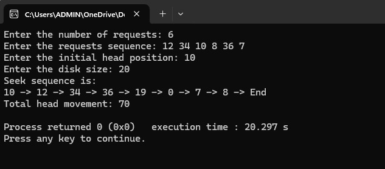
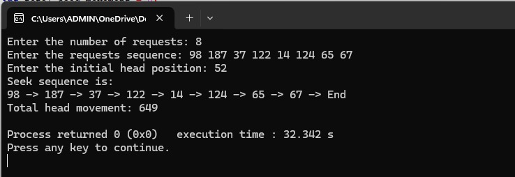
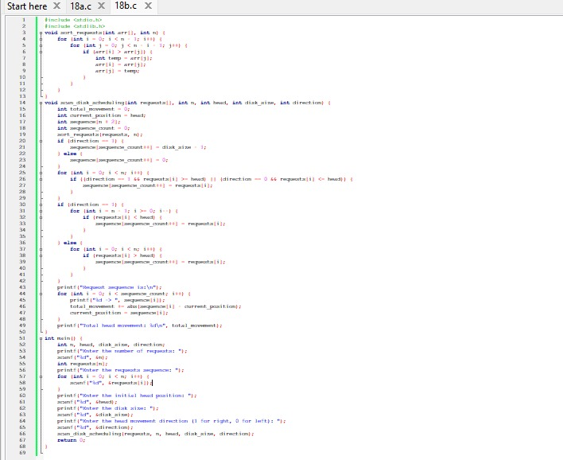

#C SCAN DISK SCHEDULING
# program file

# sample output

# tested output

# FCFS DISK SCHEDULING

# program file

# sample output

# tested output

#SCAN DISK SCHEDULING

# program file

# sample output

# tested output

