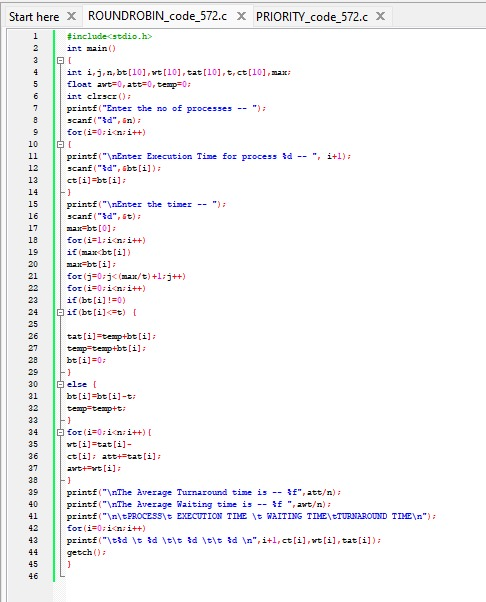
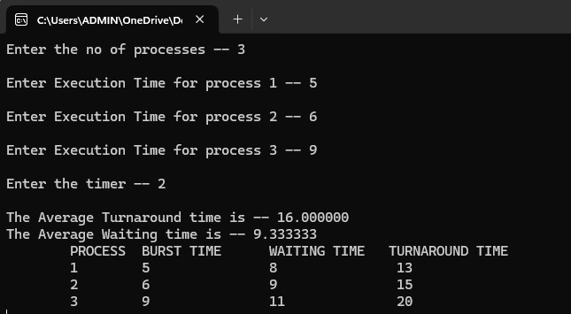
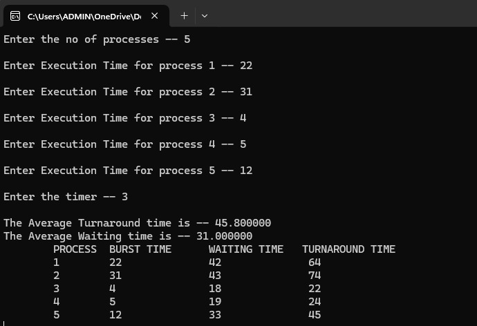
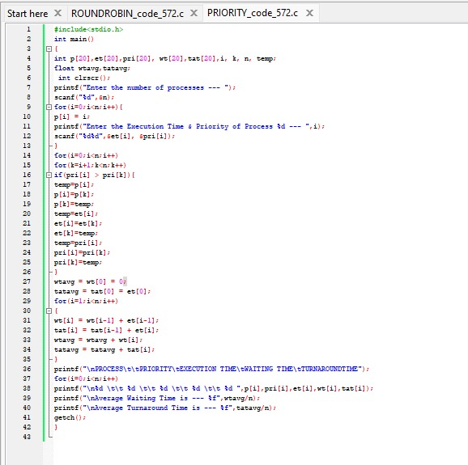
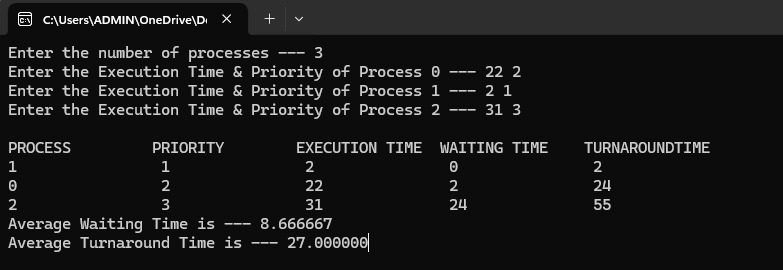
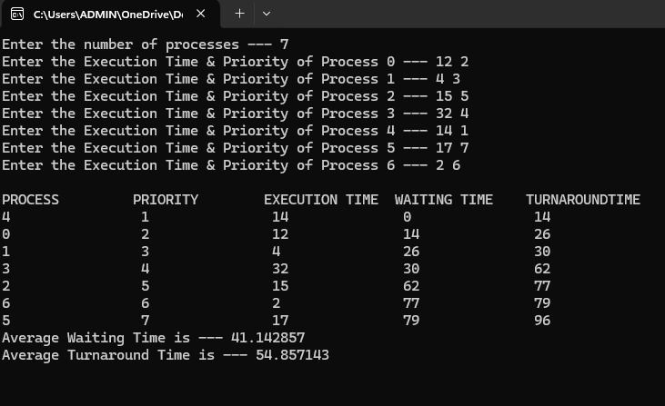

# COMPUTER-NETWORKS-AND-OPERATING-SYSTEMS-LAB
LAB PROGRAMS
# RoundRobin program status

##program files ofRoundRobin

##sample input and output of RoundRobin

##tested input and output of RoundRobin

# Priority program status

##program files of Priority

##sample input and output of Priority

##tested input and output of RoundRobin

